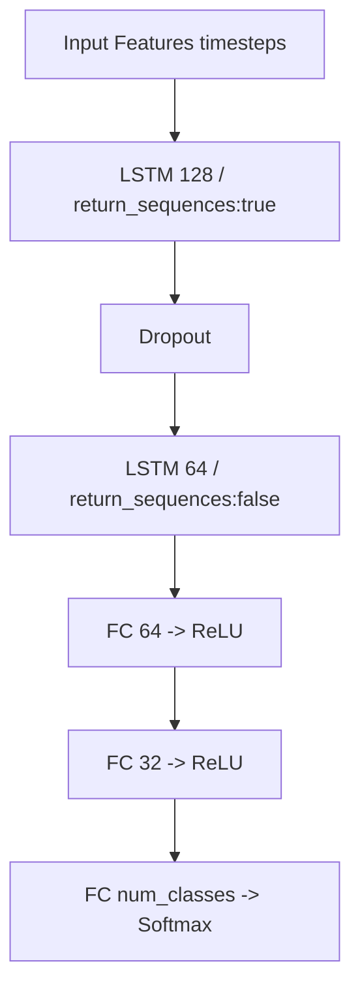
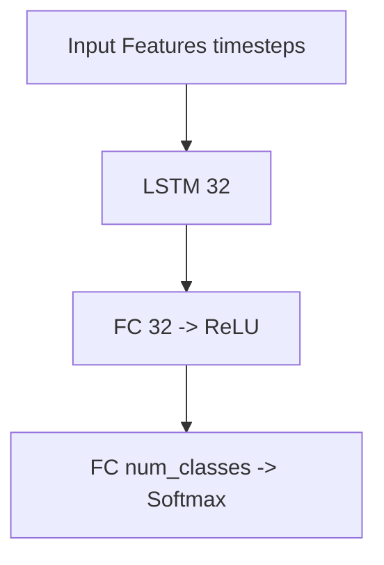
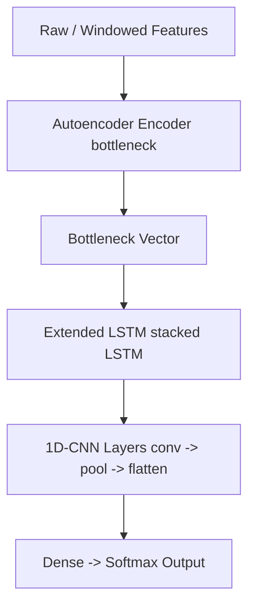

# Deep Learning–Based Intrusion Detection System (DL-IDS)

---

## Abstract

This project investigates modern deep learning architectures for intrusion detection on IoT and network traffic datasets. Using the CIC-IoT2023 dataset and a range of DL methods (MLP, CNN, LSTM, Autoencoder, and hybrid AE+LSTM+CNN), we compare performance across architectures, address class imbalance and real-time constraints, and explore model compression via knowledge distillation. The best performing pipeline — an Autoencoder + Extended LSTM + CNN hybrid — achieved **98.18% accuracy** and **F1 score 0.9802** on the test split.

---

## Table of Contents

- [Motivation](#motivation)
- [Dataset: CIC-IoT2023 (overview)](#dataset-cic-iot2023-overview)
- [Problem Statement & Objectives](#problem-statement--objectives)
- [Methodology & Model Architectures](#methodology--model-architectures)
  - [Preprocessing](#preprocessing)
  - [Architectures Evaluated](#architectures-evaluated)
- [Mermaid Architecture Diagrams](#mermaid-architecture-diagrams)
- [Experiments & Metrics](#experiments--metrics)
- [Results & Key Observations](#results--key-observations)
- [Knowledge Distillation (Model Compression)](#knowledge-distillation-model-compression)
- [Limitations & Practical Considerations](#limitations--practical-considerations)
- [Reproducible Repo Structure (recommended)](#reproducible-repo-structure-recommended)
- [Next Steps & Research Directions](#next-steps--research-directions)
- [References & Source](#references--source)

---

## Motivation

- Rapid increase in cyberattacks (e.g., ransomware predictions) and IoT device vulnerabilities motivate improved, adaptive IDS solutions. The slides report that businesses may face dramatically more frequent attacks by 2031; this motivates resilient ML/DL-based detection systems.

---

## Dataset: CIC-IoT2023 (overview)

Key dataset statistics:

- **Files:** 169 files (combined)
- **Features:** 47 unique columns (features)
- **Samples (total):** ~46,686,579 records (combined)
- **Attack types:** 34 unique attack classes (including many DDoS variants, Mirai, Recon, etc.)

### Data Characteristics

- Highly imbalanced: ~97.6% malicious vs small benign proportion in aggregated visualization
- Rich feature set suitable for both time-series sequence models (LSTM) and feature-based DL (CNN, Autoencoders)

---

## Problem Statement & Objectives

**Primary goal:** Design a DL-IDS capable of accurate, real-time detection across diverse IoT/network attack types while being robust and explainable.

### Operational Objectives

1. Detect diverse attack types (DoS, DDoS, Port Scan, Mirai, Recon, MITM, etc.)
2. High recall (>95%) to minimize missed attacks
3. High precision (>90%) to reduce false alarms
4. Real-time inference latency target: <100 ms per decision
5. Robust to zero-day and adversarial perturbations; provide operator-interpretable outputs

---

## Methodology & Model Architectures

### Preprocessing

- **Feature engineering:** One-hot encoding for categorical fields; numeric scaling using `StandardScaler`
- **Handling imbalance:** Class weighting, careful train/test splitting, and anomaly-aware approaches (Autoencoders). The dataset supports both binary and multiclass tasks

### Architectures Evaluated

- **Baseline classical:** Random Forest, clustering (Mini-Batch KMeans) for baseline comparisons
- **Deep learning models:**
  - **MLP (Dense)** with >10 layers (paper-style MLP)
  - **1-D CNN** and **2-D CNN** variants (feature maps from tabular/time windows)
  - **LSTM-Dense:** Stacked LSTM layers with dropout and dense output (multiple LSTM variants tested)
  - **Stacked Deep Autoencoder (DAE):** Multiple autoencoder stages for unsupervised representation + classification head
  - **Hybrid AE + XLSTM + CNN:** Autoencoder for compression, extended LSTM for temporal patterns, CNN for local pattern extraction — best empirical results

---

## Mermaid Architecture Diagrams

> These diagrams mirror the flowcharts presented in the PDF. Copy into GitHub README or any Markdown that supports Mermaid.

### 1) LSTM → Dense (Teacher model example)



### 2) Student Distilled LSTM (Small)



### 3) AE → XLSTM → CNN (Hybrid pipeline)



---

## Experiments & Metrics

Primary metrics reported: Accuracy, Precision, Recall, F1-score, AUC where applicable. Loss functions: Categorical Cross-Entropy. Optimizer: Adam (default in many runs).

Representative experiment notes:

- **Random Forest** used as a baseline: precision/recall curves across training batches provided
- **Clustering baseline (Mini-Batch KMeans):** Balanced accuracy and F1 indicate severe class imbalance challenges
- **LSTM variants:** Smaller LSTM (accuracy ~0.8749) vs larger LSTM (accuracy ~0.9643) depending on params and dataset subset

---

## Results & Key Observations

### Top-line Result (Final Best Model)

**AE-XLSTM-CNN Hybrid** — Test Loss: 0.0532, Accuracy: 98.18%, F1: 0.9802 on a test set of 234,741 samples

### Other Model Highlights

- **Autoencoder-Dense:** Test accuracy ~0.5808 (performed poorly for direct classification when trained in multitask setting)
- **LSTM-Dense smaller:** Accuracy ~0.8749 (Precision ~0.8847)
- **LSTM-Dense larger:** Accuracy ~0.9643 (Precision ~0.9634)

### Key Observations

- Autoencoder + LSTM + CNN hybrid offers the best trade-off between representational power and robustness
- Overfitting is a risk for overly complex models on tabular data — simpler architectures sometimes generalize better
- Memory constraints required batch processing and careful resource management

---

## Knowledge Distillation (Model Compression)

The project explores teacher→student distillation to produce lightweight models:

### Teacher Model (Example)

Input → LSTM(128) → Dropout → LSTM(64) → Dropout → FC(64) → ReLU → FC(32) → ReLU → FC(num_classes)

### Student Model (Distilled)

Input → LSTM(32) → Dropout → FC(32) → ReLU → FC(num_classes)

### Loss Function (Student)

- **Soft loss:** KL(soft_teacher_logits, soft_student_logits) with temperature T (example T=4) weighted by α (example α=0.7)
- **Hard loss:** CrossEntropy(student_logits, true_labels)
- **Final loss:** α × SoftLoss + (1 − α) × HardLoss

### Performance

- **Teacher performance:** Accuracy ~0.9611, F1 ~0.9598
- **Student validation best:** ~0.8817 in a given experiment

---

## Limitations & Practical Considerations

- **Class imbalance:** Some attack classes are severely underrepresented and require tailored strategies (oversampling, focal loss, synthesized samples, or anomaly detection approaches)
- **Resource constraints:** High memory and compute needs necessitate micro-batching and possibly streaming architectures for deployment
- **Overfitting risk:** Complex hybrid models may overfit tabular traffic features; cross-validation and simpler architectures can sometimes generalize better
- **Operationalization:** Real-time demands (<100ms) may require model pruning, quantization, or on-device distillation

---

## Reproducible Repo Structure (recommended)

```
/
├── README.md
├── requirements.txt
├── src/
│   ├── data_ingest.py
│   ├── preprocessing.py
│   ├── models/
│   │   ├── lstm_dense.py
│   │   ├── ae.py
│   │   ├── conv1d.py
│   │   ├── hybrid_ae_xlstm_cnn.py
│   │   └── distillation.py
│   ├── train.py
│   └── evaluate.py
├── notebooks/
│   ├── eda.ipynb
│   └── experiments.ipynb
├── data/
│   ├── raw/
│   └── processed/
├── results/
│   ├── figures/
│   └── metrics/
└── docs/
    └── slides.pdf  # IDS-DL.pdf (source)
```

---

## Next Steps & Research Directions

- **Adversarial robustness:** Adversarial training and certified defenses for evasion attacks
- **Explainability:** Integrate SHAP / LIME for operator-level explanations of alerts
- **Streaming deployment:** Implement low-latency inference with TensorFlow/TFLite or ONNX (prune/quantize student model)
- **Data augmentation for rare attacks:** Generative augmentation (GANs / conditional synthesis) to address class imbalance
- **Ensemble + meta-learner:** Combine anomaly detectors (AE) with discriminative models (LSTM/CNN) using a meta-classifier for calibrated alerts

---

## References & Source

All content in this README is based on the uploaded project document `IDS-DL.pdf`. For full tables, charts and raw slide content, please see the PDF.

### Selected Citations

- Erskine, S.K. (2025). Real-Time Large-Scale Intrusion Detection and Prevention System (IDPS) CICIoT Dataset Traffic Assessment Based on Deep Learning. *Applied System Innovation*.
- Farahnakian, F., & Heikkonen, J. (2018). A deep auto-encoder based approach for intrusion detection. *ICACT 2018*.
- Meena, G., & Indian, A. (2025). IDS-IoT: Enhanced LSTM. *Artificial Intelligence and Applications*.

---

## Acknowledgements

This README was prepared from the slides / report provided in `IDS-DL.pdf`. The diagrams and numerical values (accuracy, F1, loss, dataset counts, model tables) are taken from that document and its figures.
